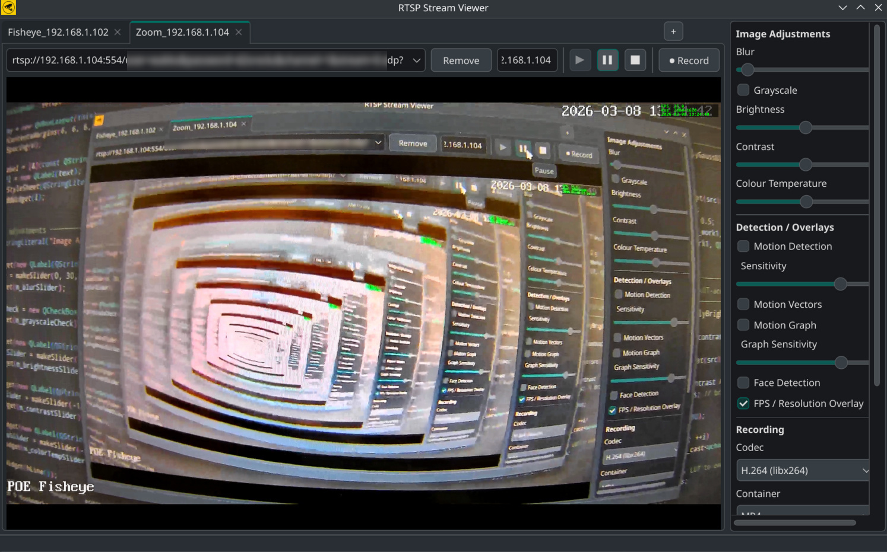

# Qt RTSP Viewer v2.0

This is a Qt6-based RTSP stream viewer with **multi-stream tabbed interface**, **real-time image processing**, **motion detection**, and **(automated) recording**.


## Disclaimer
**This project is mostly AI generated** by throwing some more or less complex prompts at Github Copilot. Making this took about 6 hours with a few very long and specific prompts for Claude Opus 4.6 to generate project structure and most of the implementation, and a long series of shorter prompts for Claude Haiku/Sonnet 4.5/4.6 to get some quirks right.

**Considering this, it works impressively well.**

## Features

### Playback & Multi-Stream
- **Tabbed stream interface** — display up to 4 RTSP streams simultaneously
- **Per-stream URL history** — persistent, searchable RTSP URL list
- **Per-camera naming** — customize display names for each stream
- **Independent playback control** — play/pause/stop each stream independently
- **Stream-specific state** — each tab maintains its own effect and recording settings

### Image Processing (Real-time, GPU-accelerated where available)
- **Blur** (Gaussian, configurable kernel size)
- **Brightness / Contrast** adjustment (LUT-accelerated)
- **Colour Temperature** correction (warm/cool)
- **Grayscale conversion**
- **Motion Detection** (contour-based with configurable sensitivity)
- **Motion Vectors** (optical flow visualization)
- **Face Detection** (Haar cascade, real-time overlay)
- **Motion Graph** (sliding grid-based activity level, per-row stacked bars with colour coding)

### Recording
- **Manual recording** — record any stream on demand
- **Auto-record on motion** — start/stop recording automatically when motion exceeds threshold
  - Configurable motion threshold (0–100 %)
  - Configurable stop timeout (1–120 seconds)
  - Automatic filename with timestamp + camera name prefix
- **Codec selection** — per-stream choice of H.264 (libx264) or H.265/HEVC (libx265)
- **Container format** — per-stream choice of MP4, MKV, or AVI
- **Persistent output folder** — global recording directory, shared across all streams
- **Frame rate control** — configurable FPS per recording session

### Overlays & Monitoring
- **FPS counter** — real-time frames-per-second and resolution display
- **Datetime overlay** — current date/time stamp (HH:mm:ss)
- **Grid motion analysis** — 6×4 cell grid with per-cell motion level (colour-coded)
- **Motion history graph** — 120-frame sliding bar chart with stacked rows

## Dependencies
- **Qt6** (Core, Gui, Widgets, Multimedia, MultimediaWidgets)
- **OpenCV** 4.0+ (image processing, face detection)
- **FFmpeg** (optional; recording support via libavcodec, libavformat, libswscale)

## Build Instructions

### Prerequisites
```bash
# Ubuntu / Debian
sudo apt-get install \
    qt6-base-dev \
    qt6-multimedia-dev \
    libopencv-dev \
    libavcodec-dev \
    libavformat-dev \
    libswscale-dev \
    build-essential cmake

# Fedora / RHEL
sudo dnf install \
    qt6-qtbase-devel \
    qt6-qtmultimedia-devel \
    opencv-devel \
    ffmpeg-devel \
    gcc-c++ cmake

# macOS (Homebrew)
brew install qt6 opencv ffmpeg
```

### Build
```bash
# Configure
cmake -B build -D CMAKE_BUILD_TYPE=Release

# Build
cmake --build build

# Optional faster build
cmake --build build -- -j4

# Output binary
./build/bin/QtRtspViewer
```

### Build with FFmpeg Support Explicitly Disabled
```bash
cmake -B build -DCMAKE_BUILD_TYPE=Release -DFFMPEG_FOUND=FALSE
cmake --build build
```

If FFmpeg is not found at configuration time, the build will complete without recording support (displays a warning).

## Usage

### Launching
```bash
./build/bin/QtRtspViewer
```

### Adding a Stream
1. Click the **"+"** button in the tab bar (top-right)
2. Enter an RTSP URL in the URL field (e.g., `rtsp://192.168.1.100:554/stream`)
3. Optionally edit the camera name (max 120 characters)
4. Click **Play**

### Recording
**Manual Recording:**
- Click the **"⏺ Record"** button while a stream is playing
- If no global output folder is set, a dialog appears to choose file, codec, and FPS
- Otherwise, recording starts automatically to `{OutputFolder}/{timestamp}_{cameraName}_recording.{ext}`

**Experimental Auto-Record on Motion:**
This will probably happen when enabling the auto-recording option and
dialing in to a suitable sensitivity. Good luck...

### Setting Output Folder
1. Click **"Select Folder…"** in the sidebar's Global Output Folder section
2. Choose a directory (created if it does not exist)
3. Recording filenames are auto-generated in this folder

## Performance Considerations
Most image processing options have a GPU(OpenCL) and a fallback CPU 
implementation. For speed!

## Configuration

Settings are stored in `~/.config/QtRtspViewer/QtRtspViewer.conf` (Linux) or the system equivalent

## Known Limitations

- **Maximum 4 tabs** — resource constraint for multi-stream processing
- **No snapshot/export** — current frame cannot be saved as image (can be added)

## Troubleshooting

### Binary crashes on startup
- Ensure OpenCV cascade file is at `./opencv/haarcascade_frontalface_default.xml` (relative to executable)
- Verify Qt6 libraries are in `LD_LIBRARY_PATH` (or use `ldd ./QtRtspViewer`)

### No video appears
- Check RTSP URL is valid and reachable (`ffprobe rtsp://...`)
- Verify camera/stream is broadcasting
- Check network connectivity

### Recording file is empty
- Ensure output folder exists and is writable
- FFmpeg support must be compiled in (check CMake configuration output)
- Check disk space

## License

GPLv2 (or whatever applies with AI generated code)
